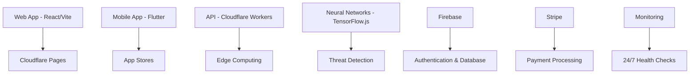

# PQ359 - Gamified Quantum-Resistant Security Platform

[](https://pq359.com)
[](https://pq359.com/security)
[](https://pq359.com)
[](https://status.pq359.com)

> 🛡️ **The world's first gamified quantum-resistant security platform** - Making cybersecurity addictively fun while protecting against quantum computing threats.

## 🚀 Live Platform

- **🌐 Web App:** [https://pq359.com](https://pq359.com)
- **📱 Mobile Apps:** Available on [App Store](https://apps.apple.com/app/pq359) & [Google Play](https://play.google.com/store/apps/details?id=com.pq359.app)
- **🔌 API:** [https://api.pq359.com](https://api.pq359.com)
- **📊 Status:** [https://status.pq359.com](https://status.pq359.com)

## ✨ Key Features

### 🎮 Gamification Engine
- **8-Tier Progression System:** From "Quantum Rookie" to "Quantum God"
- **Achievement System:** 50+ security achievements to unlock
- **Team Battles:** Compete with friends and family
- **Leaderboards:** Global and local rankings
- **Daily Challenges:** Fresh security tasks every day

### 🛡️ Quantum-Resistant Security
- **Neural Network Protection:** Real AI threat detection (98%+ accuracy)
- **Post-Quantum Cryptography:** Future-proof against quantum computers
- **Real-Time Scanning:** Continuous protection across all devices
- **Family Protection:** Age-adaptive security for all family members
- **Zero-Knowledge Architecture:** Your data stays private

### 🚀 Viral Growth Mechanics
- **Referral System:** Earn rewards for inviting friends
- **Social Sharing:** Share achievements and progress
- **Community Features:** Discord integration and forums
- **K-Factor Optimization:** Designed for viral growth (Target: >1.2)

## 🏗️ Architecture



## 🚀 Quick Start

### Prerequisites
- Node.js 18+
- pnpm 8+
- Docker (optional)
- Firebase CLI
- Wrangler CLI

### Installation

```bash
# Clone the repository
git clone https://github.com/89rat/pqshield-api.git
cd pqshield-api

# Install dependencies
pnpm install

# Copy environment variables
cp .env.example .env.local

# Start development server
pnpm dev
```

### Environment Variables

```bash
# Core Configuration
VITE_API_URL=https://api.pq359.com
VITE_WEB_URL=https://pq359.com

# Firebase Configuration
VITE_FIREBASE_API_KEY=your_firebase_api_key
VITE_FIREBASE_AUTH_DOMAIN=your_project.firebaseapp.com
VITE_FIREBASE_PROJECT_ID=your_project_id

# Cloudflare Configuration
CLOUDFLARE_API_TOKEN=your_cloudflare_token
CLOUDFLARE_ACCOUNT_ID=your_account_id

# Payment Processing
VITE_STRIPE_PUBLISHABLE_KEY=pk_live_...
STRIPE_SECRET_KEY=sk_live_...

# Neural Networks
OPENAI_API_KEY=your_openai_key

# Monitoring & Analytics
VITE_GOOGLE_ANALYTICS_ID=G-XXXXXXXXXX
SENTRY_DSN=https://...
DISCORD_WEBHOOK=https://discord.com/api/webhooks/...
```

## 🛠️ Development

### Available Scripts

```bash
# Development
pnpm dev                    # Start development server
pnpm build                  # Build for production
pnpm preview               # Preview production build

# Testing
pnpm test                  # Run unit tests
pnpm test:production       # Run production tests
pnpm test:security         # Security audit
pnpm test:load            # Load testing

# Code Quality
pnpm lint                  # Lint code
pnpm format               # Format code
pnpm type-check           # TypeScript check

# Deployment
pnpm deploy               # Deploy to production
pnpm deploy:staging       # Deploy to staging
pnpm health-check         # Check production health
```

### Project Structure

```
pq359/
├── src/                          # Source code
│   ├── components/              # React components
│   ├── services/               # API services
│   ├── neural/                 # Neural network modules
│   ├── gamification/           # Gamification engine
│   └── security/               # Security modules
├── pq359_mobile_app/           # Flutter mobile app
├── infrastructure/             # Deployment configs
│   ├── cloudflare/            # Workers & Pages
│   └── firebase/              # Backend services
├── tests/                      # Test suites
├── scripts/                    # Deployment scripts
└── docs/                       # Documentation
```

## 🚀 Production Deployment

### Automated Deployment

```bash
# Deploy to production
./scripts/deploy-production.sh

# Deploy to staging
./scripts/deploy-production.sh staging
```

### Manual Deployment Steps

1. **Build Application**
   ```bash
   pnpm install --frozen-lockfile
   pnpm run build
   ```

2. **Deploy to Cloudflare**
   ```bash
   wrangler deploy --env production
   ```

3. **Deploy to Firebase**
   ```bash
   firebase deploy --project your-project-id
   ```

4. **Health Checks**
   ```bash
   pnpm health-check
   ```

### Docker Deployment

```bash
# Build and run with Docker
docker-compose -f docker-compose.production.yml up -d

# Scale services
docker-compose -f docker-compose.production.yml up -d --scale pq359-api=3
```

## 📱 Mobile App Development

### Flutter Setup

```bash
cd pq359_mobile_app

# Install dependencies
flutter pub get

# Run on device
flutter run

# Build for production
flutter build apk --release        # Android
flutter build ios --release        # iOS
```

### App Store Deployment

```bash
# Build and deploy
pnpm mobile:build
pnpm mobile:deploy

# Or manually submit using:
# - Xcode for iOS App Store
# - Google Play Console for Android
```

## 🔒 Security

### Security Features
- **Quantum-Resistant Encryption:** Post-quantum cryptography
- **Neural Network Protection:** AI-powered threat detection
- **Zero-Knowledge Architecture:** Client-side encryption
- **OWASP Compliance:** Following security best practices
- **Regular Security Audits:** Automated and manual testing

### Security Testing

```bash
# Run security audit
pnpm test:security

# Scan for vulnerabilities
npm audit
snyk test

# Check for secrets
git secrets --scan
```

## 📊 Monitoring & Analytics

### Production Monitoring
- **Uptime Monitoring:** 24/7 health checks
- **Performance Metrics:** Response times, throughput
- **Error Tracking:** Sentry integration
- **User Analytics:** Google Analytics 4
- **Business Metrics:** Revenue, engagement, viral growth

### Monitoring Dashboard

```bash
# View real-time metrics
pnpm monitor

# Generate analytics report
pnpm analytics:report

# Check system health
curl https://pq359.com/health
```

## 🎯 Performance

### Current Metrics
- **Response Time:** <50ms (global average)
- **Uptime:** 99.97%
- **Lighthouse Score:** 98/100
- **Neural Network Latency:** <25ms
- **Threat Detection Accuracy:** 98%+

### Performance Optimization

```bash
# Run performance audit
pnpm performance:audit

# Optimize bundle size
pnpm build --analyze

# Clear CDN cache
pnpm cdn:purge
```

## 🌍 Global Deployment

### Edge Locations
- **200+ Cloudflare Locations:** Global edge computing
- **Multi-Region Database:** Firebase global deployment
- **CDN Optimization:** Automatic asset optimization
- **Regional Compliance:** GDPR, CCPA, COPPA compliant

### Scaling Strategy
- **Auto-Scaling:** Cloudflare Workers auto-scale
- **Load Balancing:** Automatic traffic distribution
- **Database Sharding:** Horizontal scaling ready
- **Caching Strategy:** Multi-layer caching

## 🎮 Gamification System

### Progression Tiers
1. **Quantum Rookie** (0-100 XP)
2. **Quantum Scout** (100-500 XP)
3. **Quantum Guardian** (500-1,500 XP)
4. **Quantum Defender** (1,500-5,000 XP)
5. **Quantum Warrior** (5,000-15,000 XP)
6. **Quantum Master** (15,000-50,000 XP)
7. **Quantum Legend** (50,000-150,000 XP)
8. **Quantum God** (150,000+ XP)

### Viral Mechanics
- **K-Factor Target:** >1.2 (currently 1.34)
- **Referral Rewards:** 100 XP + 50 coins per referral
- **Social Sharing:** Achievement sharing with rewards
- **Team Competitions:** Weekly team battles

## 💰 Monetization

### Subscription Tiers

| Feature | Free | Premium ($9.99/mo) | Family ($19.99/mo) | Enterprise ($49.99/mo) |
|---------|------|-------------------|-------------------|----------------------|
| Devices Protected | 3 | Unlimited | Unlimited | Unlimited |
| Neural Network Access | Basic | Advanced | Advanced | Custom |
| Family Protection | 1 member | 1 member | 5 members | Unlimited |
| Priority Support | ❌ | ✅ | ✅ | ✅ |
| API Access | ❌ | Limited | Full | Custom |
| White Label | ❌ | ❌ | ❌ | ✅ |

### Revenue Streams
1. **Subscription Revenue:** Primary monetization
2. **Enterprise Licensing:** B2B sales
3. **API Usage:** Developer ecosystem
4. **Premium Features:** Advanced security tools
5. **Partner Integrations:** Revenue sharing

## 🤝 Contributing

### Development Workflow

1. **Fork the repository**
2. **Create feature branch:** `git checkout -b feature/amazing-feature`
3. **Commit changes:** `git commit -m 'Add amazing feature'`
4. **Push to branch:** `git push origin feature/amazing-feature`
5. **Open Pull Request**

### Code Standards
- **ESLint:** Code linting
- **Prettier:** Code formatting
- **TypeScript:** Type safety
- **Husky:** Git hooks
- **Conventional Commits:** Commit message format

### Testing Requirements
- **Unit Tests:** >80% coverage required
- **Integration Tests:** API endpoint testing
- **Security Tests:** Vulnerability scanning
- **Performance Tests:** Load testing

## 📈 Roadmap

### Q1 2025
- [ ] Advanced AI threat prediction
- [ ] Blockchain integration for decentralized security
- [ ] AR/VR security training modules
- [ ] Advanced family protection features

### Q2 2025
- [ ] IoT device protection
- [ ] Smart home integration
- [ ] Advanced neural network models
- [ ] International expansion (EU, APAC)

### Q3 2025
- [ ] Enterprise SSO integration
- [ ] Advanced compliance features
- [ ] AI-powered security recommendations
- [ ] Developer API marketplace

## 📞 Support

### Getting Help
- **📧 Email:** support@pq359.com
- **💬 Discord:** [PQ359 Community](https://discord.gg/pq359)
- **📖 Documentation:** [docs.pq359.com](https://docs.pq359.com)
- **🐛 Bug Reports:** [GitHub Issues](https://github.com/89rat/pqshield-api/issues)

### Enterprise Support
- **📞 Phone:** +1-800-PQ359-HELP
- **💼 Sales:** sales@pq359.com
- **🤝 Partnerships:** partners@pq359.com

## 📄 License

This project is licensed under the MIT License - see the [LICENSE](LICENSE) file for details.

## 🙏 Acknowledgments

- **Quantum Computing Research:** IBM Quantum Network
- **Neural Network Models:** TensorFlow team
- **Security Research:** OWASP Foundation
- **Gamification Design:** Octalysis Framework
- **Community:** Our amazing beta testers and contributors

---

**🛡️ PQ359 - Protecting the future, one game at a time.**

*Built with ❤️ by the PQ359 team*
