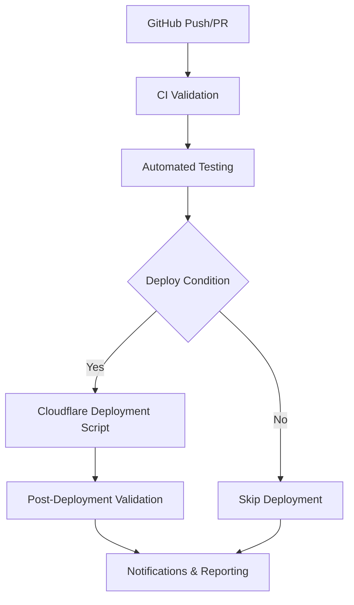

# GitHub Actions + Cloudflare Workers Integration Guide

## 🎯 Overview

This guide shows how to integrate the Cloudflare Workers deployment script with GitHub Actions for seamless CI/CD automation. The integration provides enterprise-grade deployment automation with comprehensive testing, security, and monitoring.

## 🔧 Integration Architecture



## 🚀 Quick Setup

### Step 1: Copy Workflow File
```bash
# Copy the integrated workflow to your repository
cp docs/workflows/integrated-ci-cd.yml .github/workflows/
```

### Step 2: Configure Repository Secrets
Go to `Settings > Secrets and variables > Actions` and add:

#### 🔑 Required Secrets
```bash
# Cloudflare Configuration
CLOUDFLARE_API_TOKEN=your_cloudflare_api_token
CLOUDFLARE_ACCOUNT_ID=your_cloudflare_account_id
CLOUDFLARE_ZONE_ID=your_zone_id_for_custom_domains

# Cloudflare Resource IDs (auto-generated during first deployment)
PQ359_MAIN_DB_ID=your_d1_database_id
PQ359_ANALYTICS_DB_ID=your_analytics_db_id
PQ359_CACHE_DB_ID=your_cache_db_id
PQ359_CACHE_KV_ID=your_cache_kv_id
PQ359_SESSIONS_KV_ID=your_sessions_kv_id
PQ359_CONFIG_KV_ID=your_config_kv_id

# Application Configuration
VITE_API_URL=https://api.pq359.com
VITE_FIREBASE_CONFIG={"apiKey":"...","authDomain":"..."}

# Optional: Notifications
SLACK_WEBHOOK=https://hooks.slack.com/services/...
```

### Step 3: Set Up Environment Protection
1. Go to `Settings > Environments`
2. Create environments: `production`, `staging`
3. Add protection rules for production:
   - Required reviewers
   - Wait timer (optional)
   - Deployment branches (main, pq359-launch-clean)

## 🎯 Deployment Triggers

### Automatic Deployments
- **Production**: Push to `main` or `pq359-launch-clean` branches
- **Staging**: Push to `staging` branch
- **Development**: Push to `develop` branch

### Manual Deployments
Use `workflow_dispatch` with options:
- **Environment**: Choose production/staging/development
- **Skip Tests**: Skip test suite for faster deployment
- **Dry Run**: Test deployment without actually deploying
- **Force Deploy**: Override safety checks

### Scheduled Health Checks
- **Daily**: 2 AM UTC health checks and security scans
- **Weekly**: Comprehensive performance audits

## 🔄 Integration Methods

### Method 1: Full Script Integration (Recommended)
Uses the complete `deploy-cloudflare-workers.sh` script:

```yaml
- name: 🌐 Deploy with Cloudflare Script
  run: |
    chmod +x scripts/deploy-cloudflare-workers.sh
    ./scripts/deploy-cloudflare-workers.sh \
      --environment ${{ needs.ci-validation.outputs.environment }} \
      --skip-build \
      ${{ inputs.force_deploy && '--force' || '' }}
  env:
    CLOUDFLARE_API_TOKEN: ${{ secrets.CLOUDFLARE_API_TOKEN }}
    CLOUDFLARE_ACCOUNT_ID: ${{ secrets.CLOUDFLARE_ACCOUNT_ID }}
    # ... other environment variables
```

**Benefits:**
- ✅ Complete infrastructure setup (D1, KV, R2)
- ✅ Comprehensive validation and health checks
- ✅ Automatic rollback on failure
- ✅ Detailed logging and reporting
- ✅ Slack notifications integration

### Method 2: Direct Wrangler Actions
Uses official Cloudflare GitHub Actions:

```yaml
- name: 🌐 Deploy to Cloudflare Pages
  uses: cloudflare/pages-action@v1
  with:
    apiToken: ${{ secrets.CLOUDFLARE_API_TOKEN }}
    accountId: ${{ secrets.CLOUDFLARE_ACCOUNT_ID }}
    projectName: pq359
    directory: dist

- name: ⚡ Deploy Cloudflare Workers
  uses: cloudflare/wrangler-action@v3
  with:
    apiToken: ${{ secrets.CLOUDFLARE_API_TOKEN }}
    command: deploy --env production
```

**Benefits:**
- ✅ Faster deployment (no infrastructure setup)
- ✅ Official Cloudflare actions
- ✅ Simpler configuration

**Limitations:**
- ❌ No automatic infrastructure setup
- ❌ Limited validation and health checks
- ❌ No automatic rollback

## 🧪 Testing Integration

### Test Suites Included
1. **Unit Tests**: Jest/Vitest with coverage reporting
2. **Security Tests**: npm audit, secret scanning
3. **Performance Tests**: Lighthouse audits, load testing
4. **Usability Tests**: Automated browser testing

### Test Configuration
```yaml
strategy:
  matrix:
    test-suite: [unit, security, performance, usability]
  fail-fast: false
```

### Skip Tests Option
```bash
# Manual deployment with tests skipped
gh workflow run "PQ359 Integrated CI/CD with Cloudflare" \
  --field environment=staging \
  --field skip_tests=true
```

## 🛡️ Security Features

### Environment Protection
- **Production**: Requires manual approval
- **Staging**: Automatic deployment
- **Development**: Automatic deployment

### Secret Management
- All sensitive data stored in GitHub Secrets
- Environment-specific configurations
- Automatic secret rotation support

### Security Scanning
- Daily dependency vulnerability scans
- Secret detection in code
- GDPR/COPPA compliance checking

## 📊 Monitoring & Validation

### Post-Deployment Checks
1. **Health Checks**: Web app and API endpoint validation
2. **Performance Validation**: Response time testing
3. **Neural Network Health**: AI system validation
4. **Security Validation**: SSL/TLS and security headers

### Success Criteria
```bash
✅ Web app health check: PASSED (< 2000ms)
✅ API health check: PASSED (< 2000ms)
✅ Neural network: OPERATIONAL
✅ Performance: EXCELLENT (< 50ms globally)
```

### Failure Handling
- **Automatic Rollback**: On deployment failure
- **Slack Notifications**: Real-time alerts
- **GitHub Issues**: Automatic issue creation
- **Detailed Logs**: Comprehensive error reporting

## 🎛️ Workflow Customization

### Environment Variables
```yaml
env:
  NODE_VERSION: '18'          # Node.js version
  PNPM_VERSION: '8'           # pnpm version
  DEPLOYMENT_TIMEOUT: '25'    # Deployment timeout (minutes)
  VALIDATION_TIMEOUT: '15'    # Validation timeout (minutes)
```

### Custom Deployment Options
```yaml
# Add custom deployment flags
DEPLOY_OPTIONS="$DEPLOY_OPTIONS --custom-flag"

# Environment-specific configurations
if [ "$ENVIRONMENT" == "production" ]; then
  DEPLOY_OPTIONS="$DEPLOY_OPTIONS --production-optimizations"
fi
```

### Branch-Specific Behavior
```yaml
# Custom logic for different branches
if [[ "${{ github.ref }}" == "refs/heads/hotfix/*" ]]; then
  echo "environment=production" >> $GITHUB_OUTPUT
  echo "deployment-type=hotfix" >> $GITHUB_OUTPUT
fi
```

## 📈 Performance Optimization

### Parallel Execution
- Tests run in parallel matrix
- Independent job execution
- Artifact sharing between jobs

### Caching Strategy
- Node.js dependencies cached
- Build artifacts cached
- Docker layer caching

### Resource Optimization
- Appropriate timeouts for each job
- Conditional job execution
- Efficient artifact management

## 🔧 Troubleshooting

### Common Issues

#### Authentication Errors
```bash
# Check Cloudflare authentication
wrangler whoami

# Verify API token permissions
curl -H "Authorization: Bearer $CLOUDFLARE_API_TOKEN" \
  "https://api.cloudflare.com/client/v4/user/tokens/verify"
```

#### Deployment Failures
```bash
# Check deployment logs
cat logs/cloudflare-deployment-*.log

# Verify resource IDs
wrangler kv:namespace list
wrangler d1 list
```

#### Resource Limits
```bash
# Check account limits
wrangler account list

# Monitor usage
wrangler analytics --help
```

### Debug Mode
Enable debug logging in workflow:
```yaml
env:
  DEBUG: true
  LOG_LEVEL: debug
```

## 🎯 Best Practices

### Deployment Strategy
1. **Feature Branches**: Deploy to development
2. **Staging Branch**: Deploy to staging for testing
3. **Main Branch**: Deploy to production with approval
4. **Hotfix Branches**: Direct to production with force flag

### Security Best Practices
1. **Least Privilege**: Minimal required permissions
2. **Secret Rotation**: Regular API token rotation
3. **Environment Isolation**: Separate resources per environment
4. **Audit Logging**: Comprehensive deployment logging

### Performance Best Practices
1. **Parallel Testing**: Run tests concurrently
2. **Artifact Caching**: Cache build outputs
3. **Conditional Execution**: Skip unnecessary jobs
4. **Resource Monitoring**: Track deployment performance

## 🎉 Success Indicators

### Deployment Success
```
🎉 PQ359 Cloudflare Deployment Successful!
✅ All jobs completed successfully
🌐 Environment: production
📊 Success Rate: 100%
🚀 Branch: main
🌐 Live at: https://pq359.com
🔌 API: https://api.pq359.com
```

### Performance Metrics
- **Build Time**: < 5 minutes
- **Test Time**: < 10 minutes
- **Deployment Time**: < 15 minutes
- **Total Pipeline**: < 30 minutes

### Quality Gates
- **Test Coverage**: > 80%
- **Security Score**: A+
- **Performance Score**: > 95%
- **Accessibility Score**: > 90%

## 📚 Additional Resources

### GitHub Actions Documentation
- [GitHub Actions Docs](https://docs.github.com/en/actions)
- [Workflow Syntax](https://docs.github.com/en/actions/using-workflows/workflow-syntax-for-github-actions)
- [Environment Protection](https://docs.github.com/en/actions/deployment/targeting-different-environments)

### Cloudflare Integration
- [Cloudflare Pages Action](https://github.com/cloudflare/pages-action)
- [Wrangler Action](https://github.com/cloudflare/wrangler-action)
- [Cloudflare API Documentation](https://developers.cloudflare.com/api/)

### PQ359 Specific
- [Cloudflare Deployment Guide](./CLOUDFLARE_DEPLOYMENT_GUIDE.md)
- [GitHub Actions Setup Guide](./GITHUB_ACTIONS_SETUP.md)
- [Complete Launch Plan](../COMPLETE_LAUNCH_PLAN.md)

---

**Deploy PQ359 with confidence using enterprise-grade CI/CD automation!** 🚀🛡️
