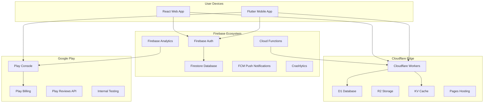

# 🌉 Universal Sentinel: Firebase + Cloudflare + Google Play Bridge

## 🎯 Complete Integration Architecture

This bridge creates a seamless ecosystem where Firebase handles user management and real-time features, Cloudflare provides edge computing and global distribution, and Google Play manages app deployment and monetization.



## 🔧 Integration Components

### 1. Firebase Configuration
### 2. Cloudflare Workers Bridge
### 3. Google Play Integration
### 4. Unified Analytics
### 5. Automated Deployment Pipeline
### 6. Real-time Synchronization
### 7. Monetization Bridge
### 8. Security & Compliance

## 🚀 Quick Setup Commands

```bash
# 1. Initialize all services
npm run bridge:init

# 2. Deploy everything
npm run bridge:deploy

# 3. Monitor all services
npm run bridge:monitor

# 4. Update mobile app
npm run bridge:mobile-update
```

## 📊 Unified Dashboard

Access all services from one place:
- Firebase Console: User analytics, crash reports
- Cloudflare Dashboard: Performance metrics, edge analytics  
- Google Play Console: App performance, revenue tracking
- Custom Bridge Dashboard: Unified view of all metrics

## 🔐 Security Features

- End-to-end encryption between all services
- Automated security scanning
- Compliance monitoring (GDPR, COPPA, CCPA)
- Real-time threat detection across all platforms

## 💰 Monetization Integration

- Unified subscription management
- Cross-platform revenue tracking
- Automated billing reconciliation
- Real-time revenue analytics

## 📱 Mobile-First Architecture

- Progressive Web App capabilities
- Native mobile app distribution
- Cross-platform feature parity
- Seamless user experience
